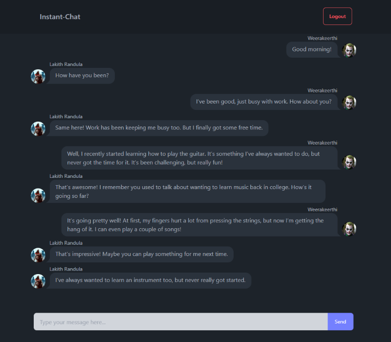

# 🗨️ Multi-User Chat Application

A real-time multi-user chat application built using **Next.js/Vite**, **Tailwind CSS**, and **Firebase**. This project enables users to send and receive messages instantly with authentication support.

## 🚀 Features

-  **Real-time Messaging** with Firebase Firestore  
-  **Multi-user Support**  
-  **User Authentication** using Firebase Auth  
-  **Modern UI** with Tailwind CSS  
-  **Responsive Design**  
-  **Instant Message Notifications**  

## 🛠️ Tech Stack

- **Frontend:** Next.js, Vite, Tailwind CSS  
- **Backend:** Firebase (Firestore, Authentication)  

## 📸 Screenshots  



## 🔧 Installation & Setup

1. **Clone the repository:**
   ```sh
   git clone https://github.com/GLRandula/chatapp.git
   cd chatapp
